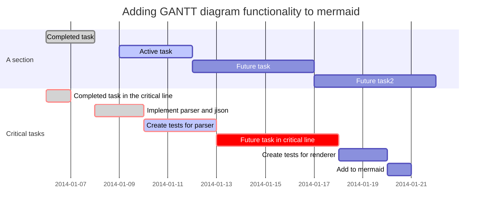

Typora编辑器，使用Markdown语法

１．基本语法：

２．绘图工具：

Markdown有绘图的语法，但较为复杂，mermaid解决这个痛点，这是一个类似markdown语法的脚本语言，通过JavaScript实现图表的生成。Typora支持mermaid语法。

[mermaid官方网址](https://mermaidjs.github.io/)

流程图基本语法：

甘特图：

等